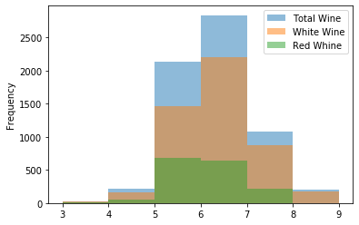
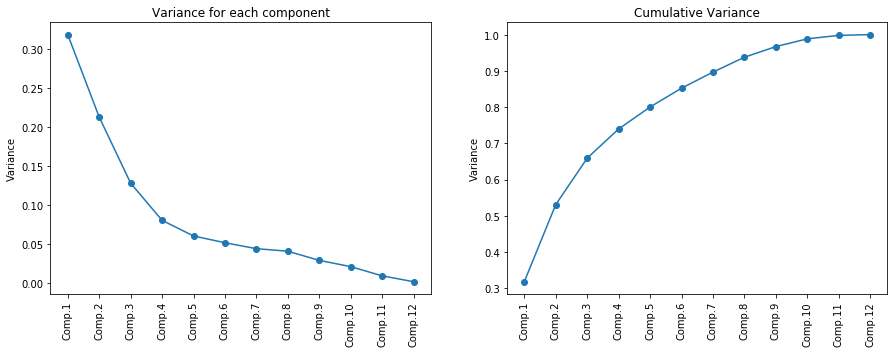

# Wine Dataset with PCA and Linear Regression
Use of Wine dataset (red+white) using PCA and Logistic Regression in order to predict "quality". 

## Data Distribution of quality Feature after joining white and red wines

## Variance distribution after PCA
After PCA we can choose to use the first 8 components only, which explain about 90% of the variance

## Linear Regression
- Training set: 70%
- Test set: 30%

## Conclusions
Not excellent results for quality prediction on this dataset, with a score of 50%.
